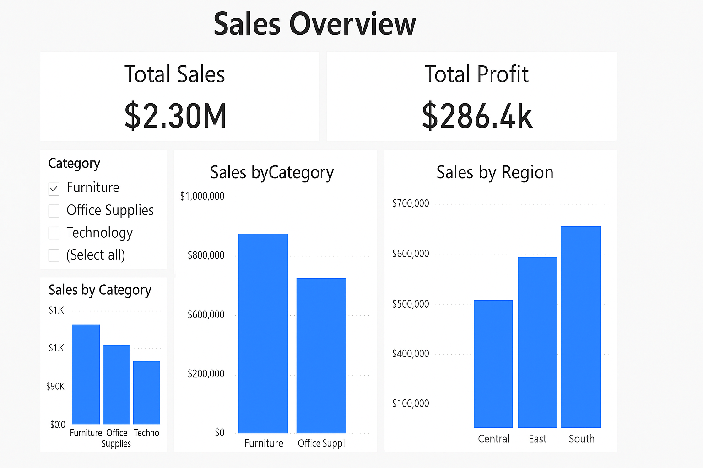

# 📈 Sales Funnel Analysis

A Power BI project analyzing drop-off rates in an e-commerce sales funnel to improve conversions.

---

## 📊 Sales Overview Dashboard

This dashboard analyzes sales and profit performance across product categories and regions using Power BI.

### 🔧 Tools Used
- Power BI for data visualization
- CSV dataset from Global Superstore
- Metrics include: Total Sales, Total Profit, Category Sales, and Regional Performance

### 🧠 Key Visuals
- KPI Cards for Total Sales and Total Profit
- Bar Charts showing Sales by Category and Region
- Slicers to interactively filter data by category### 📈 Insights Highlights

- **Technology** was the highest-grossing product category, but it showed only moderate profit margins, suggesting potential over-discounting or high fulfillment costs.
- The **West region** led in total sales, yet the **Central region** demonstrated stronger profit efficiency relative to sales volume.
- **Sub-categories** like **Tables** and **Bookcases** consistently showed **negative profit**, indicating potential areas for cost reduction or pricing strategy revision.
- High **discount rates** were correlated with **low or negative profits**, emphasizing the need for a more data-driven discounting strategy.

- 

### 📸 Screenshot

